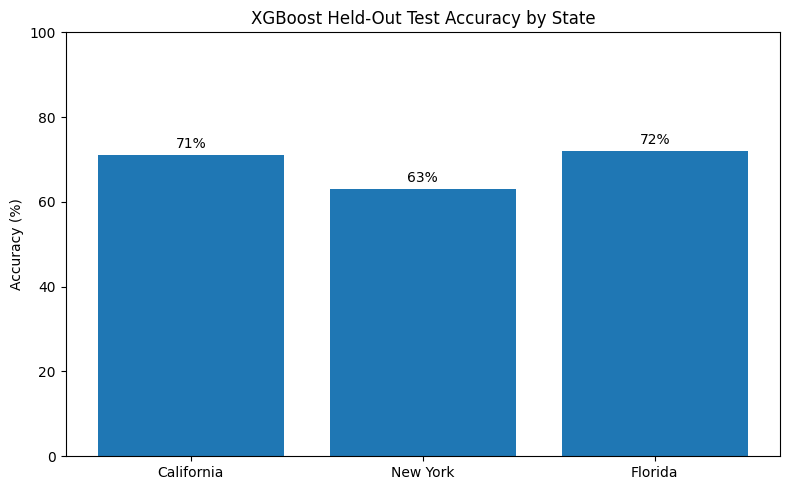

# Traffic Accident Severity Prediction

Machine learning project for predicting crash severity across California, New York, and Florida using structured accident data, feature engineering, and model comparison.

## Why This Matters
Severe traffic accidents are influenced by more than just bad weather. This project identifies the roadway, visibility, and infrastructure conditions most associated with severe crashes so that transportation agencies and planners can prioritize the highest-impact safety improvements.

## Project Overview
I built an end-to-end machine learning workflow to predict accident severity using:

- Logistic Regression
- Random Forest
- XGBoost

The project includes data cleaning, exploratory data analysis, feature engineering, model training, and evaluation across multiple state-level datasets.

## Results

- **Best model:** XGBoost
- **Held-out test accuracy:**
  - California: **~71%**
  - New York: **~63%**
  - Florida: **~72%**
- **Key predictors:** visibility-related conditions and roadway infrastructure features such as intersections and crossings were stronger predictors than adverse weather alone

## Practical Takeaways
The analysis suggests several high-value interventions:

- Improve lighting and signage in poor-visibility areas
- Prioritize upgrades at intersections and crossings
- Strengthen traffic signal enforcement and compliance measures

## Methods
### Data Preparation
- Cleaned and encoded structured accident data
- Standardized features across states where possible
- Prepared data for classification modeling

### Feature Engineering
- Time-of-day indicators
- Infrastructure-related features
- Visibility and roadway-condition variables

### Modeling
- Logistic Regression for baseline interpretability
- Random Forest for nonlinear ensemble comparison
- XGBoost for boosted-tree performance

### Evaluation
- Compared models on held-out test data
- Reviewed model accuracy and general error patterns
- Interpreted which features most influenced severity prediction

## Repository Structure
```text
traffic-accident-predictor/
├── data/              # project datasets or references to data sources
├── figures/           # charts and visuals used in the project
├── src/               # reusable project code
├── requirements.txt   # Python dependencies
└── README.md


